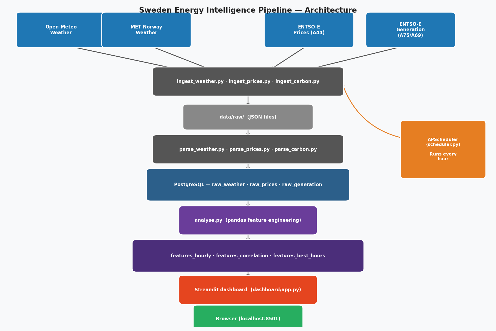

# Sweden Energy Intelligence Pipeline ⚡

> A live data pipeline that correlates Swedish weather with electricity prices
> and grid carbon intensity — updated every hour, visualised in a Streamlit dashboard.


## What it does

Fetches hourly spot prices for all four Swedish bidding zones (SE1–SE4),
weather data from two independent forecast sources, and the real-time
generation mix from ENTSO-E. It then engineers features — rolling price
averages, greenness score, best hours to run appliances — and surfaces them
in an interactive dashboard so households can decide *when* to run their
dishwasher, washing machine, or EV charger.

## Key finding

Wind speed in northern Sweden (SE1/SE2) is negatively correlated with spot
prices (Pearson r ≈ −0.3 to −0.5): more wind means cheaper, cleaner power.
Sweden's grid is already >90 % low-carbon on average, but greenness dips to
~75 % on still, overcast winter nights when wind and solar output drops.
See [findings.md](findings.md) for the full analysis.

## Architecture



## Data sources

| Source | Data | Zone |
|---|---|---|
| Open-Meteo | Temperature, wind speed, solar radiation (forecast) | SE1–SE4 |
| MET Norway | Temperature, wind speed, solar radiation (forecast) | SE1–SE4 |
| ENTSO-E A44 | Day-ahead spot prices | SE1–SE4 |
| ENTSO-E A75 | Actual generation mix (wind, hydro, nuclear, solar…) | SE3 |
| ENTSO-E A69 | Wind + solar generation forecast | SE3 |

## Stack

Python · PostgreSQL · APScheduler · Streamlit · Plotly · Docker · pandas · scipy

## Quickstart

```bash
git clone https://github.com/YOUR_USERNAME/sweden-energy-pipeline
cd sweden-energy-pipeline

cp .env.example .env
# Open .env and add your ENTSOE_API_KEY
# Get a free key at: https://transparency.entsoe.eu/

pip install -r requirements.txt

python start.py
# → starts PostgreSQL, runs the pipeline, launches http://localhost:8501
# Press Ctrl+C to stop everything.
```

`start.py` runs in order: `docker-compose up -d` → waits for DB → first pipeline run → hourly scheduler (background) → Streamlit dashboard (foreground).

## Running individual components

```bash
python pipeline/runner.py      # one-off pipeline run
python pipeline/scheduler.py   # hourly scheduler only (blocking)
streamlit run dashboard/app.py # dashboard only (DB must already be running)
```

## Project structure

```
sweden-energy-pipeline/
├── pipeline/
│   ├── ingest_weather.py       # Open-Meteo + MET Norway fetch
│   ├── ingest_prices.py        # ENTSO-E day-ahead prices
│   ├── ingest_carbon.py        # ENTSO-E generation mix
│   ├── parse_weather.py        # JSON → raw_weather
│   ├── parse_prices.py         # JSON → raw_prices
│   ├── parse_carbon.py         # JSON → raw_generation
│   ├── analyse.py              # Feature engineering → features_* tables
│   ├── run_pipeline.py         # Ingest + parse + analyse orchestrator
│   ├── runner.py               # Retry wrapper + pipeline_runs log
│   ├── scheduler.py            # APScheduler hourly job
│   ├── alerts.py               # Consecutive-failure alerting
│   └── db.py                   # psycopg2 connection helper
├── dashboard/
│   ├── app.py                  # Streamlit entry point
│   ├── charts.py               # Plotly chart functions
│   └── queries.py              # All DB query functions
├── db/
│   ├── init.sql                # Raw + pipeline_runs schema
│   └── features.sql            # Feature tables schema
├── notebooks/
│   └── exploration.ipynb       # Phase 4 EDA
├── tests/
│   ├── test_phase1.py
│   ├── test_phase2.py
│   ├── test_phase3.py
│   ├── test_phase4.py
│   └── test_phase5.py
├── assets/
│   ├── architecture.png
│   └── demo.gif
├── data/raw/                   # gitignored — raw JSON files
├── logs/                       # gitignored — pipeline.log, scheduler.log
├── docker-compose.yml
├── requirements.txt
├── .env.example
└── findings.md
```

## Findings

See [findings.md](findings.md) for the full analysis, including observed
Pearson correlations and best hours to run appliances.

## Tests

```bash
pytest tests/ -v
```

All five phases have test suites. Tests 2–4 in each phase require a running
PostgreSQL instance with at least one completed pipeline run.

## Environment variables

| Variable | Default | Description |
|---|---|---|
| `ENTSOE_API_KEY` | *(required)* | Free key from transparency.entsoe.eu |
| `DB_HOST` | `localhost` | PostgreSQL host |
| `DB_PORT` | `5433` | PostgreSQL port (docker-compose maps 5433→5432) |
| `DB_NAME` | `sweden_energy` | Database name |
| `DB_USER` | `pipeline` | Database user |
| `DB_PASSWORD` | `pipeline` | Database password |
